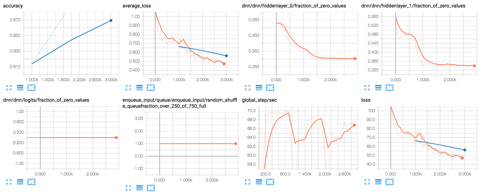

# deepneuralnet-chess
Given a chess position as input, predict the most likely result of the game.

**Results**

After only 3,000 steps and 500,000 games the model is able to predict with 91% accuracy the results of another 500,000 games.



```
accuracy: 0.90676
average_loss: 0.476108
global_step: 3000
loss: 47.61
```

To achieve these results, I performed the following steps:
  1. Process the dataset
  2. Convert the chess positions into a csv
  3. Train on the data file
  4. Evaluate the results with a separate data file

It should be noted that each data file from the dataset contains only positions obtained from *final* positions. These positions are not necessarily labeled correctly due to the fact that the dataset contains "noisy" data. For example, some games in the lichess dataset end after the first move. In addition, some players may win on time in a completely lost position. This should not be much of a problem because of the size of the dataset (The majority of games in the dataset, as far as I can tell, are fairly accurately labeled).

**The dataset**

There are many chess databases with enormous amounts of data that would be great for this project. I chose one of my favorite places to play chess, [lichess.org](http://lichess.org).

lichess is an open source chess server. They compile datasets monthly from their entire user base. The most recent count of the entire dataset at the time of this project was 241,127,059 games (approximately 47.4 GB compressed). For this project, I will use only the datasets from 2017.

You can download the original datasets from [database.lichess.org](https://database.lichess.org/). If you do not plan on processing the data yourself, you can skip to "Create the training/test data for @tensorflow".

**Processing the data**

The lichess dataset contains information that is unnecessary, even completely useless, for my project.
  1. clock times
  2. move numbers
  3. comments
  4. evaluations
  5. variations
  6. header data (tags)

To delete this unnecessary data, I am using a tool called [pgn-extract](https://www.cs.kent.ac.uk/people/staff/djb/pgn-extract/) from the University of Kent in the United Kingdom. I am also using this tool to find the *final* position of each game.

The only pgn-extract command I used is below.

```
pgn-extract --nocomments --notags --novars --nomovenumbers -F -#500000,100 <filename.pgn>
```

This command will read through <filename.pgn>, remove the unnecessary data, and output new .pgn files of 500,000 games each, starting with name 1.pgn and incrementing until there are no more matches returned from the command.

If you want to know more about the pgn-extract tool, the documentation can be found on the University of Kent's CS department website [here](https://www.cs.kent.ac.uk/people/staff/djb/pgn-extract/help.html).

**Create the training/test data for @tensorflow**

*I have already performed this process on the 2017-01 - 2017-10 datasets. You can download those directly from my Google Cloud Storage bucket:*

Each file is approximately 1-2 GB.

```
curl -O http://storage.googleapis.com/lichess/processed/<2017-month>/processed-output.csv
```

If you want to create the training/test data yourself, read on.

After processing the data with pgn-extract, I now have just the moves followed by a chess position in [FEN format](https://en.wikipedia.org/wiki/Forsyth%E2%80%93Edwards_Notation) corresponding to the final position of the game, and the result of the game (1-0, 0-1, or 1/2-1/2).

Using [process.py](https://github.com/marshalhayes/deepneuralnet-chess/blob/master/deepneuralnet-chess/process.py), I convert the FEN string as a row vector. Each column corresponds to one square of the chess board. If the square is empty, the entry is 0. If the square is occupied by a piece, for example a white rook, then the entry will be a capital R. If it was black's rook, then the entry would be a lowercase r. If it was white's knight, then the entry will be a capital N and so on.

To create the training/test data, run the process.py script from the directory which contains the pgn files you wish to process. A new file will be created in the working directory entitled "processed-output.csv" which will contain 67 columns (64 squares, who's move it is, the position in FEN format, and the result of the game). Each row corresponds to one chess position.

```
python process.py
```

If you want to create individual files for each .pgn in the working directory:

```
python process-v2.py
```

**Training the model**

Now that we have the datasets in a format that tensorflow can understand we are ready to start training! To start training, run task.py:

```
python task.py
```

This python file will read the data and convert each item in the TRAINING_DATA and TEST_DATA into tensors. After reading and learning the data, task.py will start evaluating the results. Once it finishes, you can visualize the results using tensorboard:

By default, the model directory is located in deepneuralnet-chess/tensorflow/output.

```
tensorboard --logdir=<path_to_output_directory>
```
